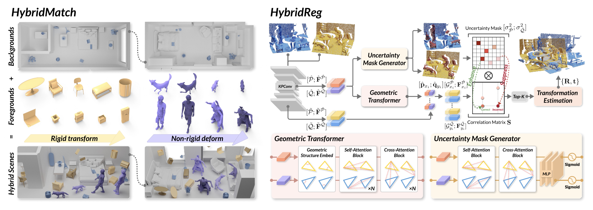

# [AAAI 2025] HybridReg: Robust 3D Point Cloud Registration with Hybrid Motions

<h4 align = "center">Keyu Du<sup>1</sup>, Hao Xu<sup>2</sup>, Haipeng Li<sup>1</sup>, Hong Qu<sup>1</sup>, Chi-Wing Fu<sup>2</sup>, Shuaicheng Liu<sup>1</sup></h4>
<h4 align = "center"> <sup>1</sup>University of Electronic Science and Technology of China (UESTC)</center></h4>
<h4 align = "center"> <sup>2</sup>The Chinese University of Hong Kong (CUHK)</center></h4>

This is the official implementation of our AAAI2025 paper, [HybridReg: Robust 3D Point Cloud Registration with Hybrid Motions](https://arxiv.org/abs/2503.07019) .

## Introduction
Scene-level point cloud registration is very challenging when considering dynamic foregrounds. Existing indoor datasets mostly assume rigid motions, so the trained models can not robustly handle scenes with non-rigid motions. On the other hand, non-rigid datasets are mainly object-level, so the trained models cannot generalize well to complex scenes.  
This paper presents HybridReg, a new approach to 3D point cloud registration, learning uncertainty mask to account for hybrid motions: rigid for backgrounds and non-rigid/rigid for
instance-level foregrounds. First, we build a scene-level 3D registration dataset, namely HybridMatch, designed specifically with strategies to arrange diverse deforming foregrounds in a controllable manner. Second, we account for different motion types and formulate a mask-learning module to alleviate the interference of deforming outliers. Third, we exploit a simple yet effective negative log-likelihood loss to adopt uncertainty to guide the feature extraction and correlation computation. To our best knowledge, HybridReg is the first work that exploits hybrid motions for robust point cloud registration. Extensive experiments show HybridReg’s strengths, leading it to achieve state-of-the-art performance on both widely-used indoor and outdoor datasets.



## Installation

Please use the following command for installation.
```bash
# It is recommended to create a new environment
conda create -n hybridreg python==3.8
conda activate hybridreg

# [Optional] If you are using CUDA 11.0 or newer, please install `torch==1.7.1+cu110`
pip install torch==1.7.1+cu110 -f https://download.pytorch.org/whl/torch_stable.html

# Install packages and other dependencies
pip install -r requirements.txt
python setup.py build develop
```

## Pre-trained Weights

We provide pre-trained weights on HybridMatch in the [weights](https://github.com/mapledky/HybridReg_PyTorch/release) page. Please download the latest weights and put them in `assets/weights/HybridMatch` directory.


## Data Preparation
Our scene-level 3D registration dataset HybridMatch can be downloaded from [HybridMatch](https://huggingface.co/datasets/kinseyxyz/HybridMatch). Put the dataset in `data` directory.

## HybridReg

### Training

The code for HybridMatch is in `experiments/hybridmatch`. Use the following command for training.

```bash
CUDA_VISIBLE_DEVICES=0 python trainval.py
```

### Testing

Use the following command for testing.

```bash
python test.py --data_dir=test/sp/high
```

Replace `test/sp/high` with `test/sp/low`, `test/bp/high` and `test/bp/low` to evaluate on different split of HybridMatch and HybridLoMatch.

## Multi-GPU Training

We limit the batch size to 1 per GPU at this time and support batch training via `DistributedDataParallel`. Use `torch.distributed.launch` for multi-gpu training:

```bash
CUDA_VISIBLE_DEVICES=GPUS python -m torch.distributed.launch --nproc_per_node=NGPUS trainval.py
```

Note that the learning rate is multiplied by the number of GPUs by default as the batch size increased.


## Citation

```bibtex
@inproceedings{du2024,
    title={HybridReg: Robust 3D Point Cloud Registration with Hybrid Motions},
    author={Keyu Du, Hao Xu, Haipeng Li, Hong Qu, Chi-Wing Fu, Shuaicheng Liu},
    booktitle={Association for the Advancement of Artificial Intelligence (AAAI)},
    month={},
    year={2025},
    pages={}
}
```

## Acknowledgements

- [GeoTransformer](https://github.com/qinzheng93/GeoTransformer)